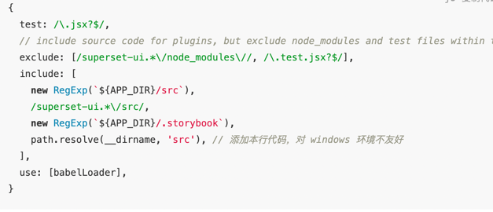

## init & install

- pip install virtualenv
- virtualenv env
- env\Scripts\activate
- 解压之前下载的 superset 源码，进入到源码目录。
- (有代理不需要这步)pip config set global.index-url https://pypi.tuna.tsinghua.edu.cn/simple
- pip install -e .
- pip install apache-superset
- pip install requests
- Pip install pillow
- pip install Werkzeug==2.0.0
- pip install  Flask==1.1.4 Jinja2==2.8 (未验证成功，不要执行)
- superset db upgrade 初始化数据库
- superset fab create-admin
- superset load_examples
- superset init
- 启动 ss server：superset run -p 3000 --with-threads --reload --debugger
- 前端初始化：cd superset-frontend
- npm install or sudo yarn
- 修改 webpack 配置:
- 启动前端： npm run dev or sudo yarn start
